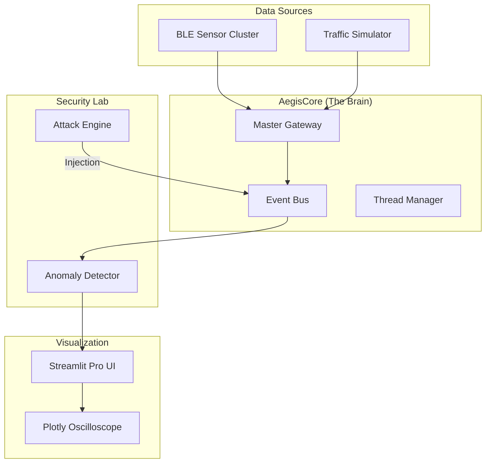

<p align="center">
  <h1 align="center">🛡️ AegisCAN-RT v3.0.2</h1>
  <h3 align="center">Advanced Real-Time BLE → CAN Automotive Gateway & Security Lab</h3>
</p>

<p align="center">
  
  
  
  
  
</p>

---
> **Latest Version v3.0.2:** Performance optimizations, enhanced attack simulation logic, improved telemetry processing, and refined deterministic gateway behavior.
> **Old Version v3.0.1:** 

## The Evolution: From Relay to Intelligence
AegisCAN-RT is no longer just a bridge. It is a **Deterministic Automotive Command Center**. Version 3.0.2 introduces a high-fidelity Streamlit dashboard, a dedicated Cyber-Attack Simulation engine, and micro-second precision analytics.

### Key Upgrades in v3.0.2
* **Streamlit Pro Dashboard:** Replaced static GUI with a web-based, hardware-accelerated telemetry hub.
* **Oscilloscope Visualization:** Real-time Plotly charts for network latency and signal jitter.
* **Attack Engine:** Native support for DoS (Denial of Service) and Bit-Flip injection testing.
* **Modular Core:** Clean separation between "threading/events" and "AI-ready predictors".

---
## Automotive Real-Time Gateway & Security Research Platform

AegisCAN-RT is a deterministic BLE → CAN real-time gateway engineered for safety-critical automotive and industrial control environments. The system is designed to emulate production-grade ECU behavior, combining deterministic message scheduling, cyber-security threat simulation, real-time telemetry analytics, and safety-aware control logic within a unified experimental platform.

Unlike conventional IoT bridges optimized for throughput, AegisCAN-RT prioritizes predictability, microsecond-level observability, and fail-safe operational behavior. The architecture enables researchers and engineers to study latency behavior, cyber-attack resilience, CAN message integrity, and system health in a controlled real-time environment.

The platform integrates a modular event-driven core, analytics-ready telemetry pipeline, and an interactive real-time monitoring interface for visualization of latency, queue depth, and signal behavior under both normal and adversarial conditions.

### Primary Engineering Objectives

• Deterministic BLE-to-CAN message delivery  
• Safety-aware scheduling for control-critical frames  
• Real-time cyber-security experimentation on CAN traffic  
• Continuous performance and health analytics  
• ECU-style fail-safe behavior under fault or attack scenarios  

---
## System Architecture



## Deterministic Gateway Engineering Comparison

| Engineering Dimension | Conventional Gateways | AegisCAN-RT Deterministic Gateway |
|----------------------|----------------------|----------------------------------|
| Latency Handling | Best-effort transmission | Deterministic low-latency processing |
| Network Stack | TCP-centric pipelines | UDP real-time streaming |
| Frame Scheduling | FIFO or uncontrolled queues | Priority-driven safety scheduling |
| Memory Flow | Multi-copy serialization | Zero-copy structured payload flow |
| Observability | Basic logging | Real-time telemetry analytics |
| Failure Detection | Reactive monitoring | Heartbeat watchdog & safety triggers |
| Cyber-Security Testing | External tooling required | Integrated threat simulation lab |
| Control System Suitability | Not designed for real-time control | ECU-style deterministic behavior |

---

## Gateway Engineering Capabilities

| Engineering Capability | Technical Outcome |
|-----------------------|------------------|
| Event-Driven Core Architecture | Modular pipeline for scalable real-time processing |
| Zero-Copy Data Handling | Reduced serialization overhead and predictable latency |
| Priority-Aware Scheduling | Critical control frames processed ahead of telemetry |
| Heartbeat Watchdog Monitoring | Immediate detection of link loss and timing faults |
| Real-Time Metrics Engine | Continuous latency, queue, and throughput monitoring |
| Cyber-Attack Simulation Engine | CAN traffic stress testing and resilience validation |
| Multi-Threaded Execution Model | Stable performance under load and simulated attacks |
| Integrated Analytics Layer | Foundations for anomaly detection and predictive models |
| Live Telemetry Dashboard | Real-time operational and security visualization |

---

## Setup & Run 

```bash
git clone [https://github.com/dhakarshailendra829/AegisCAN-RT.git](https://github.com/dhakarshailendra829/AegisCAN-RT.git)
cd AegisCAN-RT
pip install -r requirements.txt
```

```bash
streamlit run app.py
```

## Automotive Cyber-Security Research Environment

The platform functions as a controlled CAN-bus security experimentation environment designed for evaluating resilience against traffic anomalies, protocol misuse, and timing disruptions. Engineers can simulate adversarial conditions and observe deterministic gateway behavior under stress.

| Simulation Scenario | Engineering Purpose | System Behavior Studied |
|--------------------|--------------------|-------------------------|
| Traffic Flooding (DoS) | Evaluates scheduler resilience and queue prioritization | Control frame preservation under congestion |
| Payload Manipulation | Tests data integrity validation and anomaly detection | Safety logic and error handling robustness |
| Heartbeat Loss | Simulates communication link failure | Automatic transition to safe operational states |
| Timing Disruption | Injects latency variations | Deterministic scheduling stability |

> All simulations are intended for defensive research, education, and controlled laboratory environments.

---

## Engineering Applications & Research Domains

• Steer-by-Wire and Brake-by-Wire Control Simulation  
• Automotive ECU Gateway Prototyping  
• CAN Network Cyber-Security Research  
• Industrial Robotics Communication Control  
• Deterministic Telemetry Pipelines  
• Embedded Systems Real-Time Performance Analysis  
• Automotive Safety System Experimentation  
• V2X and Connected Vehicle Research Platforms  

---

## 👤 Author

**Shailendra Dhakad**  

Software Development • Embedded Systems • CAN • BLE • Real-Time Systems   

🔗 [GitHub](https://github.com/dhakarshailendra829)  
🔗 [LinkedIn](https://www.linkedin.com/in/shailendra-dhakad-063a98292/)  

---
