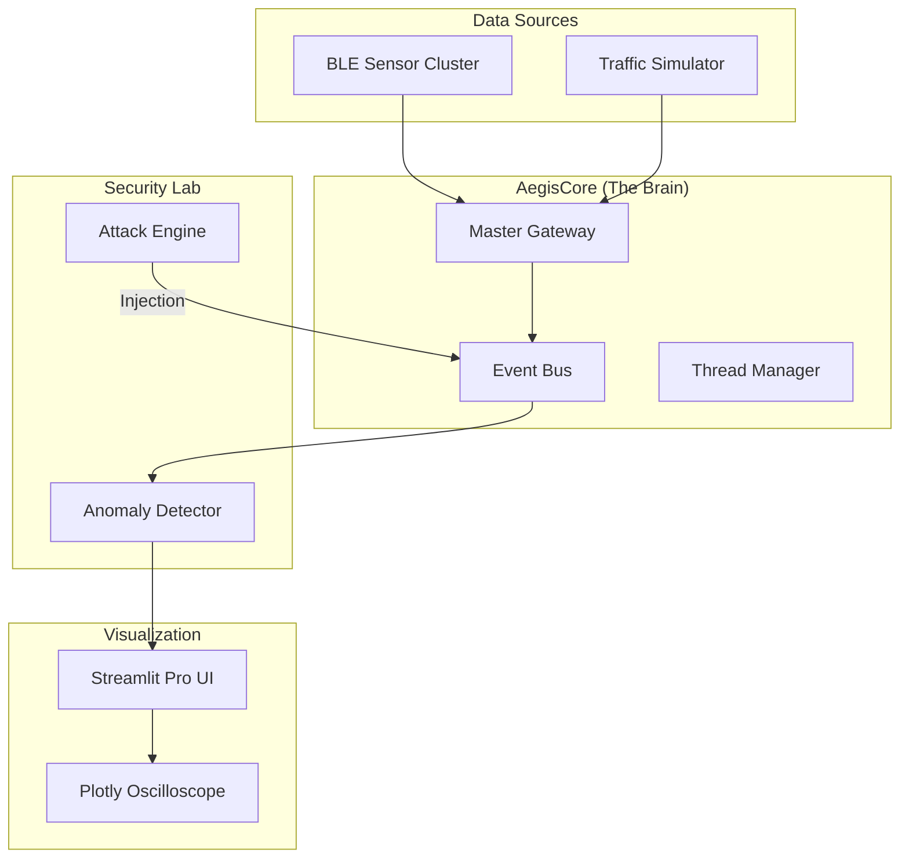

<p align="center">
  <h1 align="center">🛡️ AegisCAN-RT v3.0</h1>
  <h3 align="center">Advanced Real-Time BLE → CAN Automotive Gateway & Security Lab</h3>
</p>

<p align="center">
  
  
  
  
  
</p>

---

## 🚀 The Evolution: From Relay to Intelligence
AegisCAN-RT is no longer just a bridge. It is a **Deterministic Automotive Command Center**. Version 3.0 introduces a high-fidelity Streamlit dashboard, a dedicated Cyber-Attack Simulation engine, and micro-second precision analytics.

### ⚡ Key Upgrades in v3.0
* **Streamlit Pro Dashboard:** Replaced static GUI with a web-based, hardware-accelerated telemetry hub.
* **Oscilloscope Visualization:** Real-time Plotly charts for network latency and signal jitter.
* **Attack Engine:** Native support for DoS (Denial of Service) and Bit-Flip injection testing.
* **Modular Core:** Clean separation between `core/` (threading/events) and `analytics/` (AI-ready predictors).

---

## 🏗️ System Architecture



| Issue             | Standard Gateways | AegisCAN‑RT              |
| ----------------- | ----------------- | ------------------------ |
| Latency           | High jitter       | Deterministic (~1 ms)    |
| Protocol          | TCP blocking      | UDP real‑time            |
| Message Priority  | Best‑effort       | Safety‑aware scheduling  |
| Memory Copies     | Multiple          | Zero‑copy struct packing |
| Fault Detection   | None              | Heartbeat watchdog       |
| Timing Visibility | Absent            | µs‑level timestamping    |

---

## Gateway Engineering Highlights

| Feature                   | Engineering Impact                       |
| ------------------------- | ---------------------------------------- |
| Zero‑Copy Byte Packing    | Eliminates serialization overhead        |
| Priority‑Driven Scheduler | Steering frames always preempt telemetry |
| Heartbeat Watchdog (1 Hz) | Immediate fault and link‑loss detection  |
| Thread‑Optimized I/O      | Zero packet drop under load              |
| Latency Analytics         | End‑to‑end diagnostic visibility         |

---

## Setup & Run 

```bash
git clone [https://github.com/dhakarshailendra829/AegisCAN-RT.git](https://github.com/dhakarshailendra829/AegisCAN-RT.git)
cd AegisCAN-RT
pip install -r requirements.txt
```

```bash
streamlit run app.py
```
---
## 🛡️ Cyber-Security Vulnerability Lab

AegisCAN-RT is engineered as a stress-testing environment for automotive security researchers to evaluate CAN-bus resilience against common exploit vectors.

| Attack Vector | Engineering Objective | Impact on System |
| :--- | :--- | :--- |
| **🔥 DoS Attack** | Floods the high-priority queue with junk frames. | Tests **Steering Frame Preemption** and scheduler determinism under heavy congestion. |
| **🧬 Bit-Flip Simulation** | Dynamically corrupts specific bits in the sensor payload. | Evaluates the robustness of **CRC Checksums** and Safety Logic in the translation layer. |
| **💔 Heartbeat Drop** | Intercepts and drops the 1Hz safety watchdog signal. | Triggers **Automotive Fail-Safes** to ensure the system enters a 'Safe State' upon link loss. |

> **Note:** These tools are intended for simulation and defensive research only. Always use a virtual CAN (`vcan0`) or a closed hardware loop for testing.


---

## 🌍 Real World Applications

• Steer-by-Wire System Testing & Validation  
• Automotive ECU Gateway Simulation  
• Automotive Cyber Security & Attack Modeling  
• Industrial Robotics CAN Control Systems  
• V2X Low-Latency Communication Research  

---

## 👤 Author

**Shailendra Dhakad**  

Embedded Systems • CAN • BLE • Real-Time Systems  

🔗 [GitHub](https://github.com/dhakarshailendra829)  
🔗 [LinkedIn](https://www.linkedin.com/in/shailendra-dhakad-063a98292/)  

---
