# 🚗 RT-BLE2CAN Protocol Gateway  
### ⚡ Ultra-Low Latency | 🔐 Secure | 🏎 Automotive Grade

---

## 🎯 Why This Project Exists (The Real Problem)

> Steering-by-Wire systems **cannot tolerate >20ms delay** —  
> **Jitter = Crash Risk 🚨**

| Control Failure | Traditional Gateways | Our Gateway |
|--|--|--|
| Buffer Bloat | ❌ High Jitter | 🟢 Priority Scheduling |
| TCP Overhead | ❌ Slow Blocking | 🟢 UDP Real-Time |
| No Fail Detection | ❌ Blind & Unsafe | 🟢 Watchdog 1Hz |
| Multi-Copy Frames | ❌ Extra Delay | 🟢 Zero-Copy Struct |
| No Timing Insight | ❌ Only Arrival Time | 🟢 Full µs Profiling |

---

## 🧠 Advanced Engineering Innovations

| Feature | Technical Impact |
|--|--|
| Byte-aligned Zero-Copy | ⚡ Microsecond CAN frame packing |
| Priority Queue | Steering ALWAYS first |
| Heartbeat Monitoring | ISO-26262 fail-safe logic |
| Timestamped Packets | True Real-Time Latency ⚙️ |
| Thread-Optimized IO | No Packet Drop |

---

## 🎬 Flow Animation (Pipeline GIF)
📌 Replace link after uploading GIF in `assets/flow.gif`  

---

## 🧩 End-to-End System Architecture

```mermaid
flowchart LR
    BLE["📡 BLE Sensor\n(Steering + Timestamp)"]
    UDP["🌐 UDP Ingress\nPort 5005"]
    GW["🧠 RT Gateway\n(Priority + Struct)"]
    CAN["🚌 Virtual CAN Bus\nVCAN0"]
    HMI["📊 Latency Dashboard\nReal-Time"]

    BLE -- Encrypted Data --> UDP
    UDP -- Zero-Copy Push --> GW
    GW -- ID 0x100 🔵 Steering --> CAN
    GW -- ID 0x200 🟡 Telemetry --> CAN
    GW -- ID 0x7FF ❤️ Heartbeat --> CAN
    CAN -- µs-Latency Feed --> HMI

    style BLE fill:#0ea5e9,stroke:#082f49,stroke-width:3px,color:#fff,rx:14
    style UDP fill:#0369a1,stroke:#0c4a6e,stroke-width:3px,color:#fff,rx:14
    style GW fill:#581c87,stroke:#3b0764,stroke-width:3px,color:#fff,rx:14
    style CAN fill:#f59e0b,stroke:#b45309,stroke-width:3px,color:#fff,rx:14
    style HMI fill:#be123c,stroke:#881337,stroke-width:3px,color:#fff,rx:14
```

## ⏱️ Priority Control & Safety Logic
sequenceDiagram
    participant BLE as BLE Source
    participant UDP as UDP Socket
    participant GW as Gateway Sorter
    participant CAN as vCAN
    participant UI as Dashboard

    BLE-->>UDP: Steering + Timestamp
    UDP-->>GW: Insert → Priority Queue
    GW->>GW: Zero-Copy Struct Pack

    par Critical Steering
        GW-->>CAN: 0x100 (Blue Pulse)
    and Telemetry
        GW-->>CAN: 0x200 (Yellow Flow)
    and Safety Watchdog
        GW-->>CAN: 0x7FF (❤️ Heartbeat)
    end

    CAN-->>UI: Real-Time Status + µs Latency
## ⚙️ Setup & Run (3 Nodes)
---
git clone https://github.com/dhakarshailendra829/RT-BLE2CAN-Protocol-Gateway
cd RT-BLE2CAN-Protocol-Gateway
pip install -r requirements.txt

sudo modprobe vcan
sudo ip link add dev vcan0 type vcan
sudo ip link set up vcan0

# 1️⃣ Run Gateway
python3 src/master_gateway.py
# 2️⃣ Visual Dashboard
python3 src/dashboard.py
# 3️⃣ BLE → UDP Source
python3 src/ble_client.py
---
## 🔐 Security Layers
| Layer           | Protection             |
| --------------- | ---------------------- |
| BLE Transport   | AES-128 CCM            |
| UDP Stream      | AES-256 Encrypted      |
| Memory Handling | Zero-Copy Safe Buffers |

##🚀 Real-World Applications
EV Steering Research & ADAS
Automotive Gateway Simulators
Robotic/Industrial CAN Control
V2X Low-Latency Telemetry

##Author
Shailendra Dhakad
Embedded Systems | CAN | BLE | Real-Time Systems
📌 GitHub • LinkedIn • Portfolio
