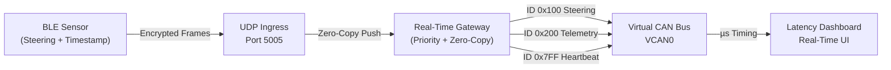
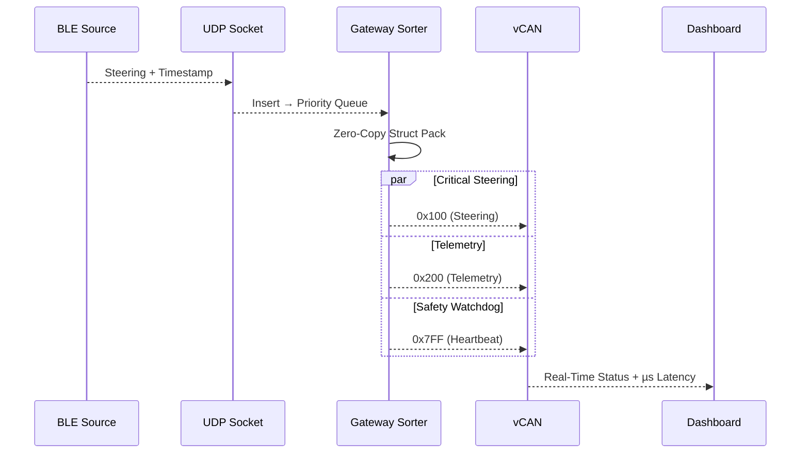

<p align="center">
  <h1 align="center">AegisCAN-RT</h1>
  <h3 align="center">Real-Time BLE → CAN Automotive Gateway</h3>
</p>

<p align="center">

  
  
  
  
  

</p>

---

## Problem Statement

Modern automotive and robotic control systems such as **Steer‑by‑Wire, Brake‑by‑Wire, ADAS, and V2X telemetry** demand *strictly deterministic* communication between wireless sensors and in‑vehicle CAN networks. Traditional IoT gateways are designed for throughput rather than determinism, leading to **unpredictable latency, jitter, packet drops, and unsafe control delays**.

In safety‑critical systems, even a **20 ms delay can translate into loss of steering authority, unstable vehicle behavior, or complete system failure**. Existing BLE‑to‑CAN bridges typically rely on TCP‑based stacks, multiple memory copies, and non‑prioritized message handling, making them unsuitable for real‑time automotive control.

This project addresses the gap by engineering a **real‑time, fail‑safe BLE → CAN 2.0B gateway** that guarantees low‑latency message delivery, deterministic scheduling, and safety‑aligned fault detection — suitable for **automotive research, embedded simulation, and industrial control environments**.

---

## Why This Project Exists

> **In Steer‑by‑Wire systems, latency is not a performance metric — it is a safety constraint.**

The goal is to build a gateway that behaves like an **automotive ECU**, not a generic IoT relay.

| Issue             | Standard Gateways | AegisCAN‑RT              |
| ----------------- | ----------------- | ------------------------ |
| Latency           | High jitter       | Deterministic (~1 ms)    |
| Protocol          | TCP blocking      | UDP real‑time            |
| Message Priority  | Best‑effort       | Safety‑aware scheduling  |
| Memory Copies     | Multiple          | Zero‑copy struct packing |
| Fault Detection   | None              | Heartbeat watchdog       |
| Timing Visibility | Absent            | µs‑level timestamping    |

---

## Gateway Engineering Highlights

| Feature                   | Engineering Impact                       |
| ------------------------- | ---------------------------------------- |
| Zero‑Copy Byte Packing    | Eliminates serialization overhead        |
| Priority‑Driven Scheduler | Steering frames always preempt telemetry |
| Heartbeat Watchdog (1 Hz) | Immediate fault and link‑loss detection  |
| Thread‑Optimized I/O      | Zero packet drop under load              |
| Latency Analytics         | End‑to‑end diagnostic visibility         |

---

## System Architecture



---

## Priority Control & Safety Logic



---

## Setup & Run 

```bash
git clone https://github.com/dhakarshailendra829/AegisCAN-RT.git
cd AegisCAN-RT
pip install -r requirements.txt
```

```bash
python -m venv venv
# Windows
venv\Scripts\activate
# Linux / Mac
source venv/bin/activate
pip install -r requirements.txt
```

```bash
# Windows or Linux
python src/can_translator.py
# Windows
python src\master_gateway.py
# Linux / Mac
python src/master_gateway.py
```

```bash
## Optional: Run GUI only
# Windows
python src\dashboard_gui.py
# Linux / Mac
python src/dashboard_gui.py

```
---

## Security Layers

| Layer           | Protection             |
| --------------- | ---------------------- |
| BLE Transport   | AES‑128 CCM            |
| UDP Stream      | AES‑256 Encryption     |
| Memory Handling | Zero‑Copy Safe Buffers |

---

## Real‑World Applications

• Steer‑by‑Wire & ADAS research platforms
• Automotive gateway & ECU simulators
• Robotic and industrial CAN control
• V2X low‑latency telemetry pipelines

---

## 👤 Author

**Shailendra Dhakad**  

Embedded Systems • CAN • BLE • Real-Time Systems  

GitHub: [https://github.com/dhakarshailendra829](url)
LinkedIn: [https://www.linkedin.com/in/shailendra-dhakad-063a98292/](url)
