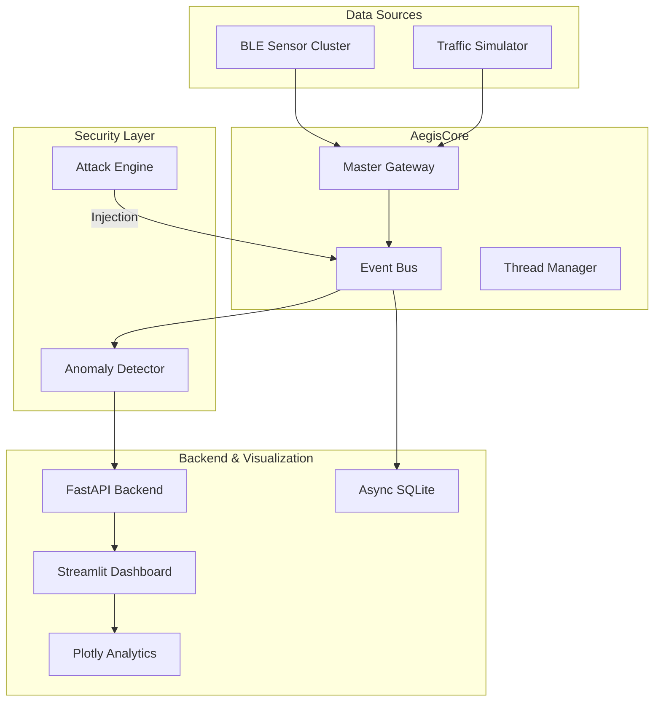

<p align="center">
  <h1 align="center">🛡️ AegisCAN-RT v3.0.3</h1>
  <h3 align="center">Deterministic Ultra-Latency BLE → CAN Automotive Gateway & Cybersecurity Research Platform  </h3>
</p>

<p align="center">
  
  
  
  
  
  
</p>

---

## Overview

**AegisCAN-RT** is a production-grade deterministic real-time gateway engineered for safety-critical automotive and industrial control systems.

It bridges **BLE sensor networks** with **CAN-2.0B vehicle buses**, while providing:

- Microsecond-level observability  
- Deterministic message scheduling  
- Integrated cyber-attack simulation  
- Real-time telemetry analytics  
- ECU-style fail-safe behavior  

Unlike conventional IoT bridges optimized for throughput, AegisCAN-RT prioritizes:

> **Predictability • Determinism • Safety • Cyber-Resilience**

---

## Engineering Objectives

- Deterministic BLE → CAN message delivery (~1ms latency)  
- Priority-aware scheduling for control-critical frames  
- Real-time CAN cyber-security experimentation  
- Continuous telemetry analytics & health monitoring  
- Fail-safe transitions under attack or fault conditions  

---

## System Architecture



---

## Core Engineering Capabilities

### 🔹 Deterministic Gateway Core
- Event-driven modular architecture  
- Zero-copy structured payload flow  
- Priority-based frame scheduling  
- Multi-threaded execution model  
- Stable under congestion & attack simulations  

### 🔹 Real-Time Observability
- Continuous latency measurement  
- Queue depth monitoring  
- Throughput analysis  
- Signal jitter visualization (Plotly oscilloscope)  

### 🔹 Cyber-Attack Simulation Engine
  Built-in controlled research lab supporting:

- DoS (Traffic Flooding)  
- Bit-Flip Injection  
- Payload Manipulation  
- Timing Disruption  
- Heartbeat Loss Simulation  

> All simulations are intended for defensive research, education, and controlled laboratory environments.

---

## Deterministic Engineering Comparison

| Dimension | Conventional Gateway | AegisCAN-RT |
|------------|----------------------|--------------|
| Latency Model | Best-effort | Deterministic low-latency |
| Scheduling | FIFO | Priority-aware safety scheduling |
| Memory Flow | Multi-copy serialization | Zero-copy pipeline |
| Failure Handling | Reactive | Watchdog-based fail-safe |
| Observability | Logs only | Real-time telemetry analytics |
| Security Testing | External tools | Integrated attack lab |
| Control Suitability | Not control-grade | ECU-style deterministic |

---

## 🛠️ Technical Stack

### Backend
- FastAPI (Async REST APIs)  
- Uvicorn  
- SQLAlchemy (Async ORM)  
- SQLite telemetry storage  
- JWT authentication (python-jose, passlib)  

### Frontend
- Streamlit Pro Dashboard  
- Plotly real-time analytics  
- Pandas time-series processing  

### Real-Time Layer
- Event-driven architecture  
- Thread manager  
- Priority queue scheduling  
- Heartbeat watchdog monitoring  

### DevOps
- Docker & Docker Compose  
- Python 3.12 Slim  
- pytest + pytest-asyncio  
- Ruff linting  
- Black formatting  
- CI/CD ready  

---

## Safety & Security Design Principles

- ISO 26262-aligned architectural mindset  
- Fail-safe state transitions  
- Deterministic scheduling guarantees  
- Secure API design with input validation  
- Controlled attack experimentation framework  

---

## Research Applications

- Steer-by-Wire simulation  
- Brake-by-Wire modeling  
- Automotive ECU gateway prototyping  
- CAN bus cyber-resilience research  
- Industrial robotics communication systems  
- Deterministic telemetry pipelines  
- V2X experimentation platforms  

---

## Installation

```bash
git clone https://github.com/dhakarshailendra829/AegisCAN-RT.git
cd AegisCAN-RT
pip install -r requirements.txt
```
## Start Backend
```bash
uvicorn backend.main:app --reload --port 8000
```
## Test the backend and API 
```bash
1. Open http://localhost:8000/docs
2. http://127.0.0.1:8000/redoc
```
---

## Run the System

### Start Streamlit Dashboard

```bash
streamlit run frontend/streamlit_app.py
```
---

## Version History
## Latest Version v3.0.3
- Fuly integrated and advanced backend development
### v3.0.2
- Performance optimizations  
- Enhanced attack simulation logic  
- Improved telemetry processing  
- Refined deterministic scheduling behavior  

### v3.0.1
- Initial deterministic gateway architecture  
- Core BLE → CAN relay engine  
- Basic telemetry monitoring  

---

## 👤 Author

**Shailendra Dhakad**  
Backend Development | Embedded Systems Engineer | Automotive Cybersecurity | Real-Time Systems Architect  

🔗 GitHub: https://github.com/dhakarshailendra829  
🔗 LinkedIn: https://www.linkedin.com/in/shailendra-dhakad-063a98292/
🔗 X: https://x.com/Engineer221131

---

## 🤝 Open To

- Automotive cybersecurity research collaborations  
- Backend engineering roles in safety-critical systems  
- Embedded systems R&D  
- Technical writing & documentation  
- Backend Development
---

> *Building deterministic, secure, safety-critical automotive systems for the next generation of intelligent mobility.*
