# RT-BLE2CAN Protocol Gateway  
### Ultra-Low Latency • Fail-Safe • Automotive-Grade


---
Projct 
## Why This Project Exists  
> In Steer-by-Wire, **20ms delay = Loss of control = Crash **

| Issue | Standard Gateways | This System |
|------|-------------------|----------------|
| Latency | High Jitter | Strict deterministic |
| Protocol Overhead | TCP Blocking | UDP Real-Time |
| Packet Monitoring | None | Heartbeat Watchdog |
| Frame Handling | Multiple Copies | Zero-Copy Struct |
| Telemetry Accuracy | No Timing | µs Timestamped |

---

## Gateway Engineering Highlights

| Feature | Benefit |
|--|--|
| Zero-Copy Byte Packing | µs CAN publishing |
| Priority Queue | Steering always first |
| 1Hz Heartbeat Watchdog | Safety failover |
| Thread-Optimized IO | Zero packet drop |
| Latency Analytics | Diagnostic insights |

---

## System Architecture  

```mermaid
flowchart LR
    BLE[" BLE Sensor\n(Steering + Timestamp)"]
    UDP[" UDP Ingress\nPort 5005"]
    GW[" Real-Time Gateway\n(Priority + Struct)"]
    CAN[" Virtual CAN Bus\nVCAN0"]
    HMI[" Latency Dashboard\nReal-Time UI"]

    BLE -- Encrypted Data --> UDP
    UDP -- Zero-Copy Push --> GW
    GW -- ID 0x100  Steering --> CAN
    GW -- ID 0x200  Telemetry --> CAN
    GW -- ID 0x7FF  Heartbeat --> CAN
    CAN -- µs Timing --> HMI

    style BLE fill:#0ea5e9,stroke:#082f49,stroke-width:3px,color:#fff,rx:14
    style UDP fill:#0369a1,stroke:#0c4a6e,stroke-width:3px,color:#fff,rx:14
    style GW fill:#581c87,stroke:#3b0764,stroke-width:3px,color:#fff,rx:14
    style CAN fill:#f59e0b,stroke:#b45309,stroke-width:3px,color:#fff,rx:14
    style HMI fill:#be123c,stroke:#881337,stroke-width:3px,color:#fff,rx:14
```


## Priority Control & Safety Logic
sequenceDiagram
    participant BLE as BLE Source
    participant UDP as UDP Socket
    participant GW as Gateway Sorter
    participant CAN as vCAN
    participant UI as Dashboard

    BLE-->>UDP: Steering + Timestamp
    UDP-->>GW: Insert → Priority Queue
    GW->>GW: Zero-Copy Struct Pack

    par Critical Steering
        GW-->>CAN: 0x100 (Blue Pulse)
    and Telemetry
        GW-->>CAN: 0x200 (Yellow Flow)
    and Safety Watchdog
        GW-->>CAN: 0x7FF ( Heartbeat)
    end

    CAN-->>UI: Real-Time Status + µs Latency

## Setup & Run (3 Nodes)
```bash
git clone https://github.com/dhakarshailendra829/RT-BLE2CAN-Protocol-Gateway
cd RT-BLE2CAN-Protocol-Gateway
pip install -r requirements.txt
```
```bash
sudo modprobe vcan
sudo ip link add dev vcan0 type vcan
sudo ip link set up vcan0
```
```bash
# 1️⃣ Run Gateway
python3 src/master_gateway.py
# 2️⃣ Visual Dashboard
python3 src/dashboard.py
# 3️⃣ BLE → UDP Source
python3 src/ble_client.py
```
## Security Layers
```
| Layer           | Protection             |
| --------------- | ---------------------- |
| BLE Transport   | AES-128 CCM            |
| UDP Stream      | AES-256 Encrypted      |
| Memory Handling | Zero-Copy Safe Buffers |
```
## Real-World Applications
* EV Steering Research & ADAS
* Automotive Gateway Simulators
* Robotic / Industrial CAN Control
* V2X Low-Latency Telemetry
---
## 👤 Author
Shailendra Dhakad
Embedded Systems • CAN • BLE • Real-Time Systems
• GitHub: https://github.com/dhakarshailendra829
• LinkedIn: https://www.linkedin.com/in/shailendra-dhakad-063a98292/
---
